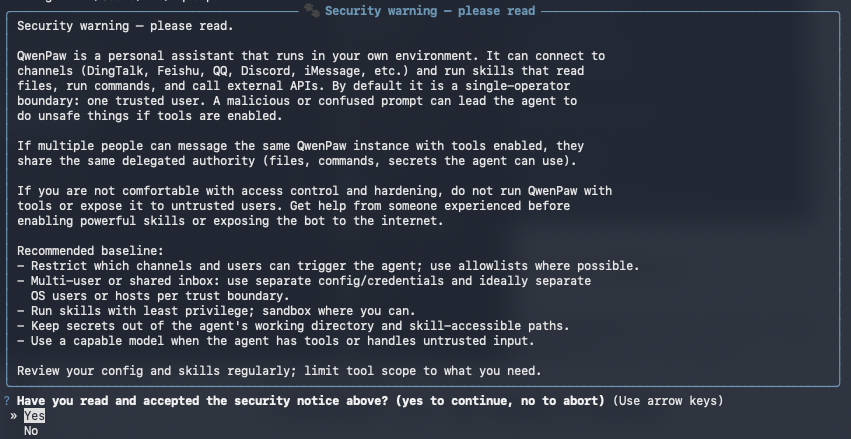
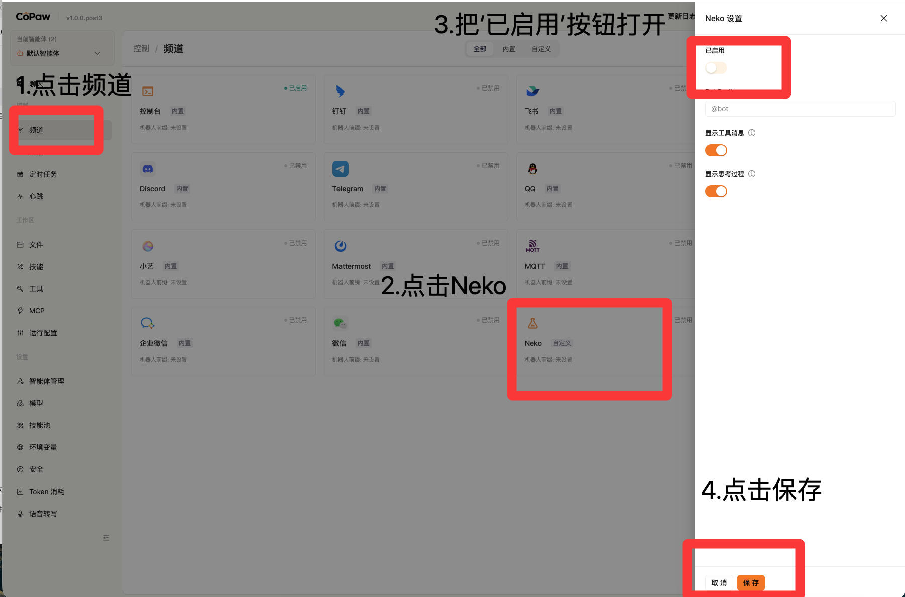
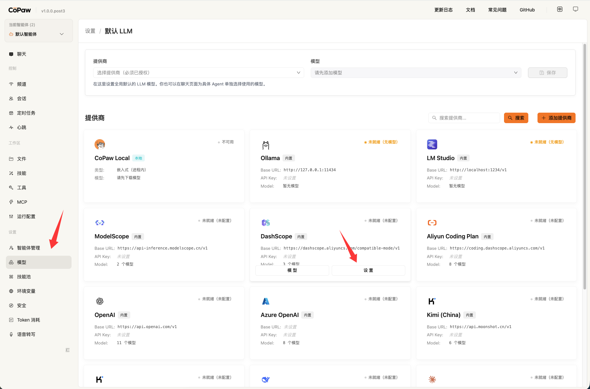

# Use NEKO to Connect to QwenPaw

## QwenPaw Installation Guide

### Step 1: Install

You do not need to configure Python manually. One command completes the setup automatically. The script downloads `uv` (the Python package manager), creates a virtual environment, and installs QwenPaw with its dependencies, including Node.js and frontend assets. Note: this may not work in some network environments or under enterprise permission restrictions.

macOS / Linux:

```bash
curl -fsSL https://qwenpaw.agentscope.io/install.sh | bash
```

Windows (PowerShell):

```powershell
irm https://qwenpaw.agentscope.io/install.ps1 | iex
```

### Step 2: Initialize

After installation finishes, open a new terminal and run:

```bash
qwenpaw init --defaults
```

This step includes a thoughtful safety warning. QwenPaw clearly tells you:

> This is a personal assistant running in your local environment. It can connect to channels, run commands, and call APIs. If multiple people use the same QwenPaw instance, they will share the same permissions, including files, commands, and secrets.



You need to choose `yes` to confirm that you understand before continuing.

### Step 3: Start

```bash
qwenpaw app
```

If startup succeeds, the last line in the terminal will show:

```text
INFO:     Uvicorn running on http://127.0.0.1:8088 (Press CTRL+C to quit)
```

After the service starts, visit `http://127.0.0.1:8088` to open the QwenPaw console.

## Configure the NEKO Channel: Connect NEKO to QwenPaw

After initialization, QwenPaw automatically creates its configuration directory. On Windows, the default path is `C:\Users\YourUsername\.qwenpaw`. On macOS, the default path is `~/.qwenpaw`. All built-in skills are enabled by default.

Find that directory. Because `.qwenpaw` is hidden:

- Windows users should open File Explorer from the taskbar, choose `View > Show`, and then enable hidden items.
- macOS users should open Finder, go to their Home folder, and press `Command + Shift + .` at the same time.

Copy the prepared channel configuration file `custom_channels` into the `.qwenpaw` folder.

Copy the [files from the character folder](assets/openclaw_guide/%E6%9B%BF%E6%8D%A2%E5%86%85%E5%AE%B9.zip) into `.qwenpaw/workspaces/default`, then delete `BOOTSTRAP.md`.

Next, press `CTRL+C` in the terminal to stop qwenpaw, and run `qwenpaw app` again to restart it.

Then follow the steps in the image to enable the Neko channel.



## Basic Setup: Model Configuration

Click Model, then choose DashScope. You can also choose a different model based on your API key. Open Settings, enter your Alibaba Cloud Bailian API key, and save it.



After saving, go back to the chat page and you will be able to select the configured model.

Return to N.E.K.O and you can start using openclaw.
